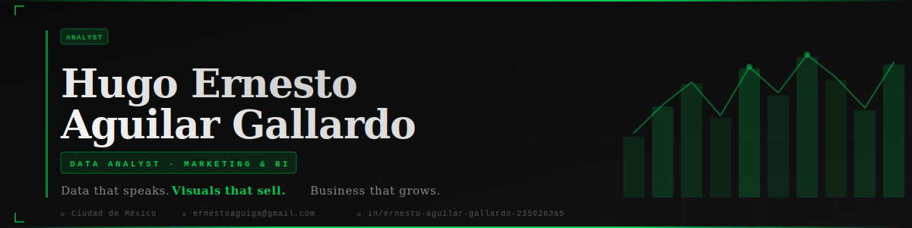

<div align="center">



</div>

---
<div align="center">

[](https://www.datacamp.com/certificate/DAA0012172108908)
[](https://cs50.harvard.edu/sql)

</div>
---

<div align="center">

### `< Hello World />` · `< Hola a todos />`

**EN** · Data Analyst with a background in Marketing and Graphic Design — I don't just read data, I translate it into business decisions and visual stories that anyone can understand.

**ES** · Analista de Datos con background en Marketing y Diseño Gráfico — no solo leo datos, los traduzco en decisiones de negocio e historias visuales que cualquiera puede entender.

</div>

---

## 🧠 About Me · Sobre mí

```python
analyst = {
    "name"       : "Hugo Ernesto Aguilar Gallardo",
    "role"       : "Data Analyst | Marketing & Business Intelligence",
    "location"   : "Ciudad de México 🇲🇽",
    "background" : ["Marketing", "Retail Administration", "Graphic Design"],
    "learning"   : ["DataCamp DA Associate", "16-Week Data Analyst Bootcamp"],
    "focus"      : "Turning complex data into clear, actionable business insights",
    "superpower" : "Bridging the gap between raw data and visual storytelling"
}
```

> *"The goal is to turn data into information, and information into insight."* — Carly Fiorina

---

## 🛠️ Tech Stack · Herramientas

<div align="center">


</div>

---

## 📂 Featured Projects · Proyectos Destacados

### 🏪 PROJECT #1 · Retail Performance Analysis & Business Intelligence Dashboard

> **EN** · End-to-end business analysis of retail operations — from raw data cleaning in Excel and SQL queries to an interactive Power BI dashboard built for non-technical decision makers.
>
> **ES** · Análisis de negocio completo de operaciones de retail — desde limpieza de datos en Excel y consultas SQL hasta un dashboard interactivo en Power BI diseñado para tomadores de decisiones no técnicos.

| Layer | Tools | Deliverable |
|-------|-------|-------------|
| 📥 Data Wrangling | Excel · Power Query | Clean dataset + documented transformations |
| 🔍 Analysis | SQL · PostgreSQL | Business queries · KPIs · Trend detection |
| 📊 Visualization | Power BI · DAX | Interactive BI Dashboard |
| 📝 Documentation | Markdown · Notion | README · Business case write-up |

**🔗 [View Repository →](https://github.com/Ernestoaguiga/Retail_Performance_Analysis)**

---

---

### 🎌 PROJECT #2 · Shibuya Art — E-Commerce SQL Analytics

> **EN** · Full SQL analytics project for a Japan→Mexico e-commerce brand. 3-phase ETL pipeline, 18 progressive business queries and an analytical layer with reusable views for marketing performance and customer segmentation.
>
> **ES** · Proyecto SQL completo para una marca de e-commerce Japón→México. Pipeline ETL de 3 fases, 18 queries progresivas y capa analítica con vistas reutilizables para marketing y segmentación de clientes.

| Layer | Tools | Deliverable |
|-------|-------|-------------|
| 🏗️ Schema Design | PostgreSQL · DDL | 5 normalized tables + indexes |
| 🔧 ETL Pipeline | SQL · DML | 200+ records across 5 tables |
| 🔍 Business Queries | SQL · CTEs · Window Functions | 18 queries — Genin to Kage |
| 📊 Analytical Layer | SQL Views | v_order_details · v_campaign_kpis · v_customer_360 |

**🔗 [View Repository →](https://github.com/Ernestoaguiga/Shibuya_Art_SQL_Analytics)**

---

## 📈 GitHub Stats · Estadísticas

<div align="center">


</div>

---

## 🎯 Currently · En este momento

- 📚 **Learning** · SQL with PostgreSQL (Week 2 — 16-Week Bootcamp)
- 🏗️ **Building** · Retail Performance Analysis & BI Dashboard (Project #1)
- 🎓 **Certifying** · DataCamp Data Analyst Associate (DA101 · DA501P)
- 🎯 **Goal** · Land my first Data Analyst role by Q3 2026

---

## 🏆 Certifications

| Certification | Institution | Date | ID |
|---|---|---|---|
| Associate Data Analyst |  | Feb 2026 | DAA0012172108908 |
| Introduction to Databases with SQL *(in progress)* |  | 2026 | — |

---

## 📬 Let's Connect · Conectemos

<div align="center">

[](https://linkedin.com/in/hugo-ernesto-aguilar-gallardo-2359263a5)
[](mailto:ernestoaguiga@gmail.com)

</div>

---

<div align="center">

*Data that speaks. Visuals that sell. Business that grows.*

`© 2026 Hugo Ernesto Aguilar Gallardo · Ciudad de México 🇲🇽`

</div>
